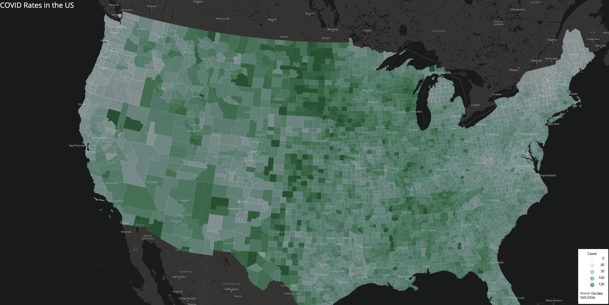
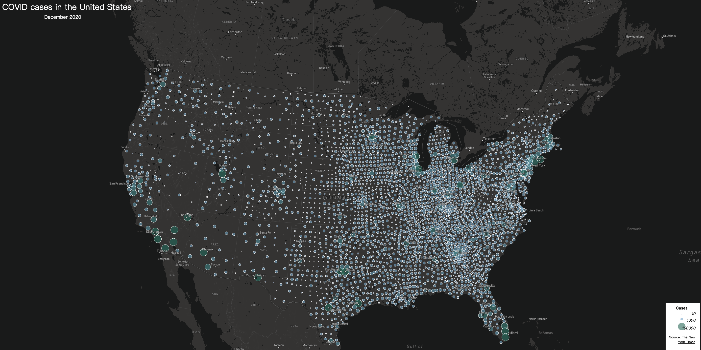

## Covid rate map [Map1](rates.html)

The map displays the COVID rate per 1000 population for each U.S. county.
The county name and corresponding data will be shown when the you click on it.

## Covid case map [Map2](counts.html)

The map provides total number of covid cases in U.S. counties. The dots are proportional to the number of cases of the county. The size and the color of the dots will change in order to represent the data. More information please check the legend. 

#### Tools used including:
* CSS
* HTML
* JavaScript

#### Data Source
* New York Times
* U.S. Census Bureau
